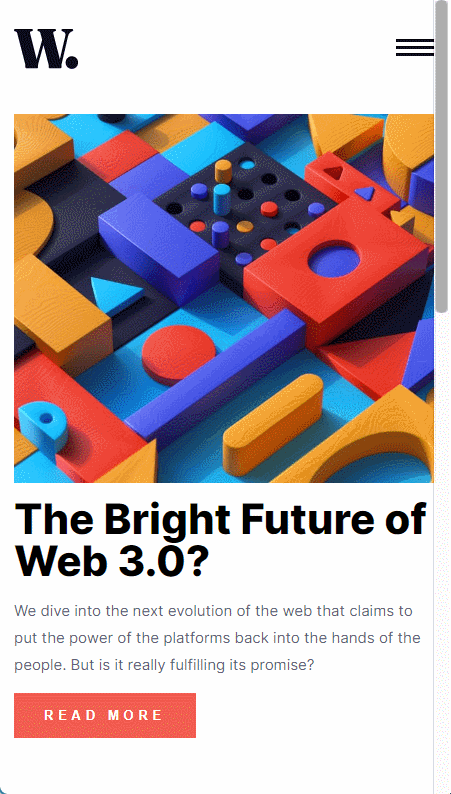

# Frontend Mentor - News homepage solution

This is a solution to the [News homepage challenge on Frontend Mentor](https://www.frontendmentor.io/challenges/news-homepage-H6SWTa1MFl). Frontend Mentor challenges help you improve your coding skills by building realistic projects.

## 목차

- [개요](#overview)
  - [챌린지 안내](#the-challenge)
  - [구현 예시(스크린샷 또는 영상)](#screenshot)
  - [링크](#links)
- [작업 사항](#my-process)
  - [기술 스택](#built-with)
  - [학습 및 문제 해결 사항](#what-i-learned)
  - [추가 개발 희망 사항](#continued-development)
  - [참고 링크](#useful-resources)
- [제작자](#author)

## 개요

### 챌린지 안내

제작자는 아래의 내용을 반드시 구현해야 함.

- View the optimal layout for the interface depending on their device's screen size
- See hover and focus states for all interactive elements on the page
- **Bonus**: Toggle the mobile menu (requires some JavaScript)

### 구현 예시 (스크린샷 또는 영상)

**데스크탑 버전**


**모바일 버전**


### 링크

- [챌린지 업로드 사이트](https://www.frontendmentor.io/solutions/19th-challenge-news-webpage-that-used-react-and-styledcomponents-hCzv--6Z76)
- [구현된 챌린지 사이트](https://drunkenneoguri.github.io/newswebpagechallenge/)

## 작업 사항

### 기술 스택

- HTML5
- CSS3
- [React](https://reactjs.org/) - JavaScript 라이브러리
- [styled-components](https://styled-components.com/) - CSS in JS 라이브러리

### 학습 및 문제 해결 사항

### 📚 작업하면서 배운 것들

1️⃣ **keyframes을 이용한 UI/UX 애니메이션 처리 복습**

keyframe을 이용하면 화면에 출력되는 UI/UX의 애니메이션 처리를 진행할 수 있다.

여기서는 head나 일부 section을 고려해 모바일 화면에서 스크롤을 내리면 UI/UX가 출력되거나, 데스크탑에서 보게 될 시 head 등의 일부 태그에 애니메이션을 부여해 시각적으로 눈에 띄도록 유도해봤다.

- head 태그의 keyframe 애니메이션 적용/코드

  ```jsx
  import { keyframes } from "styled-components";

  export const slidePopUp = keyframes`
    0% {
      right: -70vw;
    }
    100% {
      right:0;
    }
  `;
  ```

  위와 같이 keyframes를 별도의 파일로 설정 후, 해당 내용을 App.js에 가져와 불러오게 했다.

  ```jsx
  import { slidePopUp } from "./keyframes";

  .
  .
  .

  const AsideNav = styled.nav`
    background: var(--off--white);

    display: flex;
    flex-direction: column;
    position: absolute;

    right: 0;
    width: 70vw;
    height: 100vh;
    z-index: 4;

    animation: **${slidePopUp}** 0.4s ease-out;

    & > a {
      display: inline-block;

      font-size: 1rem;
      font-weight: 400;
      text-decoration: none;
      color: var(--very--dark--blue);

      margin: 1rem;
      margin-right: auto;

      cursor: pointer;

      transition: 0.05s ease;
    }

    & > a:hover {
      color: var(--soft--red);
    }
  `;
  ```

  import와 export를 적절하게 이용함으로서 styled-components에 사용할 keyframes를 여기저기에 컴포넌트처럼 사용할 수 있다.
  구현된 결과는 아래와 같다.

  

2️⃣ **grid 방식의 cell 병합 방법**

데스크탑 화면에서 화면 구성을 맞추려고 하니 flex보다는 grid가 해당 영역에 더 어울릴 거라고 생각했다.
그래서 grid를 이용해 화면 구성을 맞추려고 했는데 아래와 같은 문제가 발생했다.


보다시피 grid는 각 영역별로 정해진 범위에 맞춰서 조정이 되다보니, 본래 이미지와 같이 만드려면 하단의 cell들이 하나의 영역으로 합쳐질 필요가 있었다.

이럴 경우를 어떻게 해결해야할까, 찾아본 결과 나온 답은 ‘grid-column’과 ‘grid-rows’였다.

해당 영역을 합치기 위해 grid를 선언한 영역의 코드에 다음과 같이 CSS 내용을 추가했다.

```jsx
const ArticleSection = styled.section`
  display: flex;
  flex-direction: column;
  padding: 1rem;

  @media screen and (min-width: 1124px) {
    max-width: 1110px;
    display: grid;
    grid-template-columns: 730px 350px;
    gap: 2rem;
    margin: 0 auto;
    **& > article:nth-child(3) {
      grid-column: -1 / -3;
    }**
  }
`;
```

grid의 영역을 고려하면 좌측 상단부터 1-2-3-4로 나뉘어 지는데, 여기서 저 하단 부분에 해당하는 내용은 3번째이므로 3번째 자식 article 요소에 grid-column을 부여함으로서 셀 병합을 구현했다.

저렇게 내용을 넣자, 아래와 같이 원하던 그림이 나왔다.


3️⃣ **스크린 너비 변경에 따른 img 태그 내 src 변환**

이번 페이지를 구현하면서 가장 어려웠던 점은 **화면 너비를 유동적으로 고려해야 하는 점**이었다.
반응형 웹의 특성 상, 화면이 줄어들거나 늘어남에 따라서 내용에 변화가 생길 수 있는 점을 고려해야 하는데 그러다보니 ‘**메인 기사 영역의 이미지**’를 구현하는 게 좀 어려웠다.

해당 이미지는 모바일 버전과 데스크톱 버전, 두 개로 나뉘어져 있다보니 스크린 사이즈에 맞춰 유동적으로 이미지를 변경할 필요가 있어보였다.

그러나, **HTML과 CSS 만으로는 화면 너비를 계속해서 체크하는 게 불가능하다고 생각**되었고 이를 이용하려면 **JavaScript의 도움이 필요**하다고 판단했다.

화면 너비를 생각하면 `resize`를 계속해서 체크할 수 있도록 적용해야 하는데, `EventListener`를 이용한다면 그걸 구현할 수 있을 거라고 생각했다.

하지만, 현재 React로 구현하고 있는 만큼 렌더링이 일어날 때마다 EventListener가 무수히 발생하도록 하면 안 되기에 useEffect를 통해서 EventListener가 한 개만 붙여지도록 유도했다.

```jsx
function App() {
	// 우선 화면 너비를 저장할 state를 생성하자.
	const [viewWidth, setViewWidth] = useState(window.innerWidth);

	  // useEffect를 통해서 화면이 리사이즈가 일어날 때마다 EventListener가 동작하도록 했다.
	  useEffect(() => {
	    window.addEventListener("resize", setViewWidth(window.innerWidth));

	    return () => {
	      window.removeEventListener("resize", setViewWidth(window.innerWidth));
	    };
	  }, [viewWidth]);
	.
	.
	.
}
```

처음엔 위와 같이 코드를 작성했는데, 작동이 되지 않았다.

왜일까? 하면서 확인해보니 `useEffect`가 일어나지 않는 것이 원인이었는데, 내가 화면 너비를 아무리 바꾸고 해봐도 `window.innerWidth`의 값이 처음에 설정한 값 그대로를 받아오고 있었다.


그렇다면 결국 화면 너비가 변동되면서 `window.innerWidth` 값도 갱신이 되어야 `setViewState`가 적용된다는 건데, 위의 방식이 아니라면 어떻게 해결해야할까?

검색을 해본 뒤 방법을 찾아내 아래와 같이 코드를 작성했다.

```jsx
function App() {
	**// (1) 우선 화면 너비를 저장할 state를 생성하자.**
	const [viewWidth, setViewWidth] = useState(window.innerWidth);

  **// (2) useEffect를 통해서 화면이 리사이즈가 일어날 때마다 EventListener가
	// 동작하도록 했다.**
  useEffect(() => {

		**// (3) resize가 일어날 때마다 함수를 사용하게 해 setState가 계속 일어나게 했다.**
		const setWindowWidthResize = () => {
      setViewWidth(window.innerWidth);
    };

    window.addEventListener("resize", **setWindowWidthResize**);

    return () => {
      window.removeEventListener("resize", **setWindowWidthResize**);
    };
  }, [viewWidth]);
}
```

작성했던 코드와 다른 건 안에 넣었던 `setState`를 `useEffect` 안에 함수를 만들어 넣었다는 점이다.

화면이 `resize`가 일어날 때마다, 함수가 `EventListener`는 `setWindowWidthResize` 함수를 동작시킬텐데, 함수 안에 있는 setState를 작동시키게 된다.

먼저 작성했던 코드에서는 EventListener가 window.innerWidth의 값에 변화를 느끼지 못하고 고정된 값으로 인식했다면, 해당 코드에서는 **함수가 불러질 때마다 setState가 작동되면서 내부의 값을 계속해서 갱신**시켜주기 때문에 화면의 너비 변화를 인식할 수 있게 된다.

아마, 이 부분이 내가 많이 어려워하는 **클로저의 개념과 근접하다고 생각**하는데 이건 추가적으로 공부를 해봐야겠다.

아무튼 위와 같이 코드를 구현하니 아래처럼 동작하게 되면서 이미지 변경 문제를 해결하게 됐다.


### 추가 개발 희망 사항

- 모바일 화면에서 스크롤을 내릴 시에 fade-in-out 등으로 article 영역 UI 출력을 연출해보는 것
- 스크린 리더를 통해 해당 영역의 기사들을 키보드로 컨트롤하여 읽히도록 구현하는 것

### 참고 링크

- [이번에야말로 CSS Grid를 익혀보자 – 1분코딩](https://studiomeal.com/archives/533) - Grid에 관한 설명을 정말 알기 쉽게 설명해준 사이트.
- [Get window Width and Height in React](https://bobbyhadz.com/blog/react-get-window-width-height) - React를 이용해 유동적으로 화면 너비를 체크하기 위한 방법을 알려준 사이트.
- [2022-11-02: styled-components에서 keyframe 적용하기](https://develop-neoguri.notion.site/2022-11-02-styled-components-keyframe-b007f21cd32040ceb52b5741849bb687) - CSS의 keyframe 설정과 styled-components의 keyframe 설정 방법을 공부했던 링크.

## 제작자

- Frontend Mentor - [@DrunkenNeoguri](https://www.frontendmentor.io/profile/DrunkenNeoguri)
- Twitter - [타자치는 너구리(@develop_neoguri)](https://twitter.com/develop_neoguri)
